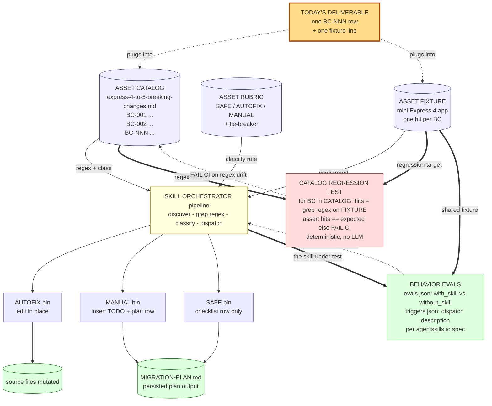

# Track 4 · `framework-modernizer` — fork the pattern to your own migration

> Tracks 1–3 each shipped one Skill against `zava-storefront/`. **Track 4 teaches you how to fork that pattern** to any framework migration your team actually cares about — Next 14→15, Spring Boot 2→3, .NET 6→8, whatever's on your roadmap. You'll run a design Skill (`genesis`) on a migration brief, diff its output against our worked Express 4→5 reference, then author one new catalog entry against your own pair. You won't finish a full fork in 35 minutes — but you'll leave knowing exactly what to build at home, and *why* this shape generalizes to every framework migration you'll ever ship.

⏱️ **~35 min**

> 📦 **About the deliverable.** Tracks 1–3 ship a tagged `v0.1.0` Skill. Track 4 doesn't — the value here is in the design move, not the artifact. The full fork (catalog + rubric + fixture + two test layers) is hours of work you'll do at home with the design Genesis hands you in §3.

---

## 📚 Theory anchor

- **Live:** [Architectural Patterns Rosetta Stone — *Pipeline / Catalog patterns*](https://danielmeppiel.github.io/agentic-sdlc-handbook/handbook/ch18-architectural-patterns-rosetta-stone.html)
- **Live:** [The Reference Architecture](https://danielmeppiel.github.io/agentic-sdlc-handbook/handbook/ch04-the-reference-architecture.html)

**Local fallback (3 sentences):** Major framework upgrades are 80% mechanical (catalog the breaking changes, find them, autofix the trivial ones) and 20% judgment. LLMs hallucinate "breaking changes" from training data — the fix is not a smarter model but **a source-of-truth catalog with citations + a regression test that proves the regexes still match + behavior evals that prove the skill outperforms `without_skill`**. The Catalog → Rubric → Skill → (regression + behavior evals) shape generalizes: pick *any* X→Y framework pair and the same artifacts ship a defensible modernizer.

---

## 🔍 Why this track is different

We built [`framework-modernizer`](../../.apm/skills/framework-modernizer/) as a worked example for Express 4→5 — catalog of cited breaking changes, classifier rubric, fixture, regression test, behavior evals. **You'll skim it, run its tests, then design your own.** The skim and the test run are warm-up; the real work starts at §3 when you point Genesis at *your* migration and watch it derive an architecture.

Running Genesis is cheap: it's a pure in-agent design session. No compilation, no CI, no PAT. Cold-prompting it on a fork brief and reading the 8-step output it returns is faster than reverse-engineering the shape from someone else's `DESIGN.md` — and it's the loop you'll use long after the workshop on every non-trivial Skill you ship.

> 📦 **Productization heads-up.** The modernizer pattern you're reading here has graduated to a productized accelerator in [`DevExpGbb/zava-agent-config`](https://github.com/DevExpGbb/zava-agent-config) under `plugins/accelerators/modernize-kit/` (v6.1.0+), shipping with both `framework-modernizer` (Express 4→5, the reference here) and `nextjs-modernizer` (Next 14→15, verified against `zava-storefront/`). Once your fork is solid, that's the home for it — not in a one-off team repo.

---

## 🧠 1 · Skim the reference design (5 min)

Open [`.apm/skills/framework-modernizer/references/DESIGN.md`](../../.apm/skills/framework-modernizer/references/DESIGN.md). It's the **Genesis 8-step handoff packet** persisted as a doc. Skim — don't deep-read — to set expectations for what shape your own Genesis run will produce:

- **Step 1 — intent.** Single capability, single framework pair. *Not* a "migrate any framework" mega-skill.
- **Step 2 — components.** Why **PIPELINE** beat PANEL here (no independent lenses; classification is mechanical).
- **Step 5 — the four artifacts.** Catalog (cited breaking changes) → Rubric (SAFE/AUTOFIX/MANUAL classifier) → Skill (orchestration) → Eval (regex regression test).
- **Step 7 — the handoff packet.** What every fork of this pattern needs.

Then glance at [`.apm/skills/framework-modernizer/references/express-4-to-5-breaking-changes.md`](../../.apm/skills/framework-modernizer/references/express-4-to-5-breaking-changes.md). **Every entry cites a section anchor on `expressjs.com`.** That's Rule #1: no invented breaking changes.

---

## 🏃 2 · Run the tests (5 min)

The skill ships **two test layers** — both scaffolded by Genesis when this skill was designed:

| Layer | What it tests | Run it |
|---|---|---|
| **Catalog regression** ([`evals/run.js`](../../.apm/skills/framework-modernizer/evals/run.js)) | The deterministic substrate — locks the catalog regexes against the fixture so a bad regex edit fails CI. No LLM. | `node .apm/skills/framework-modernizer/evals/run.js` |
| **Behavior evals** ([`evals/evals.json`](../../.apm/skills/framework-modernizer/evals/evals.json) + [`triggers.json`](../../.apm/skills/framework-modernizer/evals/triggers.json)) | The skill's actual behavior — each case runs twice (with_skill / without_skill) to make the value delta measurable. Per [agentskills.io spec](https://agentskills.io/skill-creation/evaluating-skills). | Manual / harness-driven — see [`evals/README.md`](../../.apm/skills/framework-modernizer/evals/README.md) |

Run the catalog regression now (fast, hermetic):

```bash
node .apm/skills/framework-modernizer/evals/run.js
```

You should see:

```
✅ framework-modernizer catalog regression PASSED (8 findings match expected)
```

Now invoke the skill on the same fixture from your harness — this is one of the prompts in `evals.json` (case `fm-c1-explicit-migration`):

> "Migrate this Express 4 app to Express 5. Audit for breaking changes, apply safe fixes in place, and write a migration plan I can hand to my team. Fixture: `.apm/skills/framework-modernizer/evals/fixtures/express4-app/`."

You'll get a `MIGRATION-PLAN.md` with three phases: autofixed (already done), manual (with code pointers), validation checklist. Read the plan — note how the SAFE/AUTOFIX/MANUAL classifications come from [`classifier-rubric.md`](../../.apm/skills/framework-modernizer/references/classifier-rubric.md), not the model's intuition.

> 💡 **Why two layers?** The catalog regression test catches "did someone break the regex?" in CI. The behavior evals catch "does the skill *actually help* a real LLM produce a better migration plan than no skill at all?" — and that's the question agentskills.io says you must be able to answer for any skill you ship.

---

## 🪄 3 · Run Genesis live on your migration (10 min) — the centerpiece

Pick one migration from the table below and run Genesis against it. **Next 14 → 15 is the safe default** — it matches the `zava-storefront/` you've been working in and has the most-codified upstream guide. Pick another only if you have a specific interest.

| Migration | Upstream guide (paste this URL into the prompt) | Why it's a good fit |
|---|---|---|
| **Next.js 14 → 15** *(default)* | <https://nextjs.org/docs/app/guides/upgrading/version-15> | App Router stable surface; codified migration guide; *applies to `zava-storefront/`* — natural take-home |
| React 17 → 18 | <https://react.dev/blog/2022/03/08/react-18-upgrade-guide> | Strict mode, `createRoot`, automatic batching — high mechanical surface |
| Spring Boot 2 → 3 | <https://github.com/spring-projects/spring-boot/wiki/Spring-Boot-3.0-Migration-Guide> | Jakarta EE namespace flip — the canonical "regex-friendly" migration |
| .NET 6 → 8 | <https://learn.microsoft.com/dotnet/core/compatibility/8.0> | `Program.cs` minimal hosting; explicit changelog per release |

Now run Genesis cold. Paste this prompt into your harness, swapping in the migration name and the URL from the row you picked:

```
/genesis Design a framework-modernizer skill for <X → Y> based on
this reference guide: <upstream migration guide URL>. Then show me
the proposed agentic system architecture as an ASCII diagram and
explain why you designed it that way.
```

That's it. Genesis owns the rest — that's the whole point of the skill. Let it run end-to-end. You'll get back a design proposal that **may or may not** look exactly like our Express 4→5 reference — that's what §4 is for.

> 🎒 **Brought your own?** If you came with a migration on your team's roadmap (Mode B) or with your own source code you want Genesis to scope against (Mode C), point Genesis at it instead. The 8-step process is the same; the brief just gets longer ("the target codebase is at `<path>`; scope to its actual surface, not a generic case"). Variants are welcome — they make §4's diff more interesting.

---

## 🔬 4 · Diff Genesis's output against the reference design (3 min)

Open Genesis's fresh packet next to [`references/DESIGN.md`](../../.apm/skills/framework-modernizer/references/DESIGN.md). You're looking for two things — what survived the change of framework, and where Genesis legitimately broke from our reference.

**Five moves should carry across most migrations.** These are the durable shape; the names and node count will differ, the moves shouldn't:

- **A pipeline, not a panel.** Discover → classify → dispatch, in that order, single-pass. There are no independent expert lenses to synthesize, so adding agents would invent disagreement the data doesn't have.
- **Every finding cites a catalog row.** The catalog is the *only* license to emit a "you have a breaking change here." No row, no finding. This is the single thing that stops hallucinated migrations cold.
- **Grep does the matching, not the LLM.** The catalog ships regexes; a deterministic tool runs them; the LLM never re-derives a match from recall. (Java/.NET forks may swap grep for a real AST tool — same role, different deterministic substrate.)
- **The migration plan is a persisted file** the team executes from later — not a transient chat message that scrolls off.
- **Two test layers, two failure modes caught.** A deterministic catalog regression test (no LLM, locks the regexes against the fixture so a bad regex edit fails CI) plus behavior evals (`with_skill` vs `without_skill`, per [agentskills.io](https://agentskills.io/skill-creation/evaluating-skills), so you can prove the Skill outperforms a baseline LLM with no Skill loaded).

**Where Genesis may legitimately diverge** (variants are not wrong — they reflect your migration's reality):

- **The architectural shape itself may differ.** If your migration has independent lenses — e.g. type-system migration *and* dependency upgrade *and* config flip all needing different expertise — Genesis may propose a panel of specialists instead of a pipeline. That's a signal about your migration's surface area, not a Genesis bug.
- **Composition decisions** — your fork may externalize the catalog as its own module if you have multiple Java migrations sharing one entry format; ours inlines it.
- **The classifier rubric tie-breaker** — risk profile differs by ecosystem. Java's namespace flips skew toward AUTOFIX; .NET hosting-model changes skew toward MANUAL.
- **Tool selection** — JavaScript skills lean on grep; Java/.NET skills may need a real AST tool (`jdt`, Roslyn) because regex on type-system changes is brittle.
- **Evals shape** — the behavior eval prompts will name your framework's idioms; the catalog regression's expected-findings table will have a different cardinality.

If Genesis returned something *structurally* very different from our reference — for example, no catalog at all, or no regression test layer — that's worth a question to your facilitator. Either your migration genuinely needs a different shape (interesting!) or the brief under-specified something Genesis filled in with a weaker default.

> 📚 **Going deeper.** The "why these patterns" answers — including the formal names Genesis uses for each move (PIPELINE, ATTENTION ANCHOR, DETERMINISTIC TOOL BRIDGE, PLAN MEMENTO) — are in the [Architectural Patterns Rosetta Stone chapter](https://danielmeppiel.github.io/agentic-sdlc-handbook/handbook/ch18-architectural-patterns-rosetta-stone.html) and [The Reference Architecture](https://danielmeppiel.github.io/agentic-sdlc-handbook/handbook/ch04-the-reference-architecture.html). Read them after the workshop as you build your full fork — you'll want the vocabulary then.

---

## ✍️ 5 · Author one new catalog entry (10 min) — the actual deliverable

You have Genesis's design for your fork. Now ship the smallest concrete piece of it: **one new catalog entry** (one row, in the format you saw in `express-4-to-5-breaking-changes.md`), one fixture line that demonstrates it, and a regex you've verified by hand. That's the workshop-time deliverable — proof you can execute against your own design, not just read someone else's.

Use the example entry Genesis proposed in §3 as your starting point, or pick a different breaking change from your migration guide if Genesis's pick wasn't the most illustrative one for your audience.

### Reference shape — the express-4-to-5 closed loop

This is the closed-loop architecture our reference skill ships. Compare it to Genesis's diagram for your fork: the nodes will rename, some edges may move, but the **closed loop across catalog / rubric / orchestrator / regression test / behavior evals** is the durable shape — remove any one artifact and the others lose their grip on reality. (Rendered in Mermaid; Genesis emits ASCII into your chat.)



**Why this shape (and what Genesis will recognise in your fork):**

- **A pipeline wrapped by two test layers.** Single-pass discover→classify→dispatch — no per-task agents, nothing to synthesize. If your Genesis run returned a multi-agent shape, that's signal your migration has independent lenses ours doesn't.
- **The migration plan is a persisted file** (`MIGRATION-PLAN.md`). The Skill writes it; the team executes from it. The plan outlives the chat, which is what makes it auditable.
- **Every finding cites a catalog row.** The catalog is the *only* license to emit a "you have a breaking change here." No row → no finding. Hallucinated migrations cannot enter the pipeline.
- **A deterministic tool does the matching, not the LLM.** Grep and the catalog regression test are the truth substrate. The LLM never adjudicates whether a regex matches. (Yours may swap grep for an AST tool — same role, different bridge.)
- **The classifier is closed.** Three bins: SAFE, AUTOFIX, MANUAL. Inventing a fourth class inline means your catalog is wrong, not your rubric.
- **Two test layers, two failure modes caught.** Catalog regression catches "did someone break the regex?" — deterministic, CI-friendly. Behavior evals catch "does the Skill actually outperform no-Skill on a real prompt?" — inference-based, per agentskills.io. Skipping either leaves a class of regression undetected.
- **Today's deliverable** is the orange node: one catalog row + one fixture line. The orchestrator, rubric, and both test layers are reused — you're feeding them, not rebuilding them.

**Fork failure modes Genesis tends to surface:** (1) catalog rows without source-anchor URLs → hallucinated migrations; (2) a new catalog entry without a matching fixture line → the regex rots silently in the regression test; (3) regression assertion `hits >= 1` instead of `== expected` → false positives slip through; (4) classifier drift (a fourth bin invented inline); (5) AUTOFIX used where rewrite needs cross-file awareness — bias-to-safety lives in the rubric tie-breaker; (6) shipping with no behavior evals → no evidence the Skill outperforms a baseline LLM with no Skill loaded → may be cargo-culted prompt scaffolding adding nothing.

> 🛠️ **Today's deliverable is one BC-NNN entry**, not the full pipeline. The diagram above is the *reference shape* — it tells you what slot your one entry plugs into and why the catalog citation discipline matters (every node downstream of "Catalog" is a function of catalog quality).

**Schema for one entry** (mirror exactly what `express-4-to-5-breaking-changes.md` uses):

```markdown
### BC-NNN — <short title>

- **Classification:** SAFE | AUTOFIX | MANUAL
- **Source:** <official guide URL with anchor>
- **Detect:** `<javascript regex>`
- **Example match:** `<one-line fixture snippet>`
- **Fix (if AUTOFIX):** `<replacement snippet>`
- **Notes:** <one-line rationale, no marketing>
```

**Workshop-time check:** create a fixture file with your example match + one decoy line (no match), run the regex with `grep -nE '<your-regex>' fixture.txt`, confirm it matches the line you expect and *not* the decoy. **That's your catalog regression discipline in miniature.** When you've finished the full fork, ask Genesis to scaffold the behavior evals (`evals.json` + `triggers.json`) — that's the second layer the workshop's framework-modernizer ships.

---

## 📦 Take-home: the full fork

You won't finish the fork in this session. The path home:

1. **Build the catalog.** From the official upstream migration guide, extract every breaking change as `BC-NNN` with: ID, classification, source citation, detect regex, fix snippet. Cite anchors.
2. **Build a fixture.** A minimal app that triggers a representative subset of catalog entries. Annotate each line `// EXPECT-NNN`.
3. **Build expected findings** for the regression test. `BC-ID<TAB>file<TAB>line` rows the runner must reproduce.
4. **Wire the regression test.** Copy `evals/run.js` and swap the `PATTERNS` array.
5. **Run the regression test.** Iterate until green.
6. **Scaffold the behavior evals.** Ask Genesis: *"Use the genesis skill to scaffold evals for this skill per agentskills.io spec."* It will produce `evals/evals.json` (3 content evals with `with_skill` / `without_skill` shape) + `evals/triggers.json` (~20 dispatch trigger queries split 60/40 train/val). Then run them per [`evals/README.md`](../../.apm/skills/framework-modernizer/evals/README.md) and ship only when `with_skill` shows measurable delta over `without_skill`.

The file-by-file substitution is in `DESIGN.md` "Forking this pattern."

For an internal stretch: target your own platform repo (e.g. [`zava-platform`](https://github.com/DevExpGbb/zava-platform) as a public reference) — fork the modernizer for **Next 14 → 15** and run it against this template's own `zava-storefront/`. Have the skill open a PR with the autofixed phase committed and `MIGRATION-PLAN.md` attached.

---

## 🎓 What you learned

- **Source-grounded skills beat clever prompts.** A 12-row catalog with cited anchors beats "use your knowledge of Express 5" every time.
- **Two test layers, two failure classes.** Catalog regression tests catch deterministic substrate drift in CI. Behavior evals (per [agentskills.io](https://agentskills.io/skill-creation/evaluating-skills)) catch "does the skill actually outperform `without_skill`?" Without both, you're guessing.
- **Pipeline > Panel for mechanical work** — *most of the time*. Don't reach for fan-out/synthesizer when classification is deterministic. But Genesis may legitimately propose a different pattern if your migration's surface area genuinely has independent lenses — trust the design dialogue, not the template.
- **Genesis is cheap enough to use as a thinking tool.** Cold-prompting it on a fork brief and reading the 8-step output is faster than reverse-engineering the shape from someone else's `DESIGN.md`. Use it on every non-trivial skill you ship, not just the ones you're stuck on.
- **The handoff packet is portable.** A persisted `DESIGN.md` is what makes a skill forkable. Without it, the next fork starts from zero.
- **One entry teaches the discipline.** The full catalog is engineering effort; the *shape* is what generalizes — and you saw it generalize when you diffed Genesis's output for your migration against ours.

