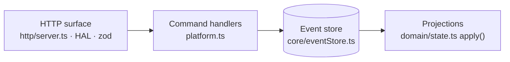
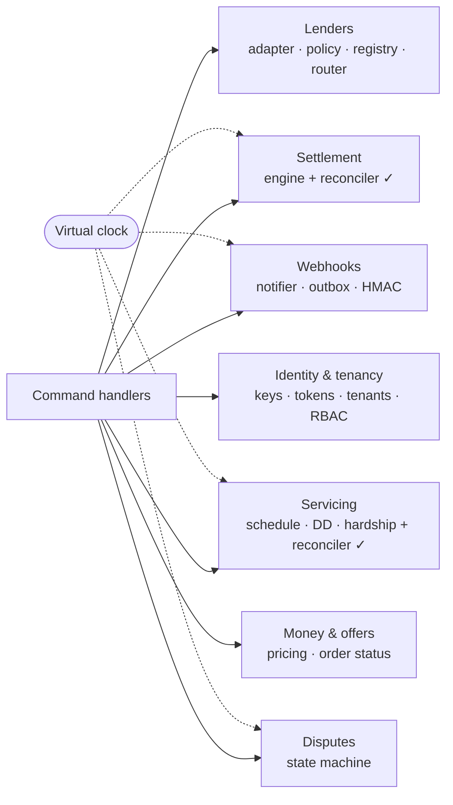
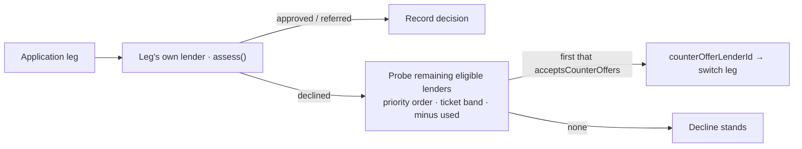
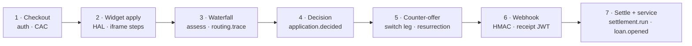
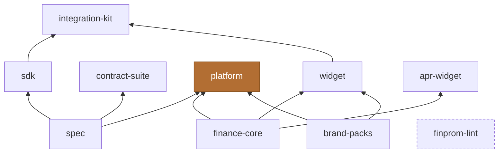

# Lendrail v2 — Architecture

A clean-room **multi-lender point-of-sale finance orchestration platform**. Merchants embed a
checkout widget; a waterfall router places each application with one of three simulated lenders
behind a sealed adapter; the platform runs the full lifecycle — offers, counter-offers, webhooks,
settlement, disputes, and consumer loan servicing — with **every state change folded from one
append-only journal**.

> This is the Markdown twin of `pdf/architecture.pdf`. Same content, rendered natively by GitHub
> (Mermaid diagrams + tables) so it can be read and diffed as source.

---

## Architectural invariants

The whole system is organized around five laws that recur in every subsystem:

| # | Invariant | What it means |
|---|-----------|---------------|
| 01 | **Event-sourced** | All state is a pure fold of one append-only JSONL journal. No SQL, no ORM. |
| 02 | **Sealed adapters** | Lenders see DTOs only — never the store, clock, or HTTP. `assess()` is pure & replayable. |
| 03 | **Router records, never decides** | The waterfall sequences legs and freezes a trace; it holds no outcome literal. |
| 04 | **Twin reconcilers** | Settlement & servicing each pair a deterministic engine with an independent re-derivation. |
| 05 | **Virtual clock** | Every timer runs on a controllable clock, re-armed from projections on boot. |

---

## 1 · System topology

Ten client surfaces reach the platform through three distinct connection styles. Ports are canonical,
from `packages/spec/conventions.json`.

```mermaid
flowchart TD
  subgraph SDKC["Server-side · @lendrail/sdk"]
    store["Store — Voltora :7410<br/>Kestrel :7414 · storeApi :7411"]
    democart["Demo-cart — Larkspur :7415<br/>@lendrail/integration-kit"]
  end
  subgraph SPA["Browser SPA → HTTP"]
    dash["Dashboard :7412"]
    lops["Lender Ops :7413"]
    svc["Servicing PWA :7440<br/>/consumer/*"]
  end
  subgraph STAT["Static / embed"]
    widget["Checkout widget<br/>(embed · CAC + HAL)"]
    portal["Portal :7432"]
    misc["Explorer :7420 · Docs :7430 · Landing :7431"]
  end

  PLAT{{"@lendrail/platform · Fastify :7401"}}
  JRNL[("events.jsonl<br/>append-only journal")]

  store -->|SDK| PLAT
  democart -->|kit| PLAT
  dash -->|HTTP| PLAT
  lops -->|HTTP| PLAT
  svc -->|HTTP| PLAT
  widget -->|HAL links| PLAT
  portal -. config.json .-> PLAT
  PLAT --> JRNL
```

**Three connection styles**

- **Server-side via SDK** — `store` (Voltora/Kestrel) and `demo-cart` (Larkspur) call the platform
  from their own servers; ports are resolved from conventions, never hardcoded.
- **Browser SPA → HTTP** — `dashboard`, `lenderops`, and the `servicing` PWA fetch the platform
  directly; each derives its base URL from the hostname + `conventions.ports.platform`.
- **Static / embed** — `explorer`, `docs`, `landing`, `portal` make no live platform calls; the
  checkout `widget` is loaded on a merchant page and discovers everything from a CAC (checkout JWT)
  and HAL links.

The platform request path is a four-stage spine over the journal:



`data/journal/events.jsonl` is the single source of truth (webhook deliveries live in a separate
`webhook-deliveries.jsonl`). Robustness: torn-tail repair, seq-gap refuses boot, encrypted snapshot
cache, PII-at-rest codec.

---

## 2 · Platform kernel — subsystems

Command handlers dispatch into these services. Each writes journal events; queryable state is the
fold. Two subsystems ship an **independent verifier** that re-derives the engine's claims from the
raw journal.



| Subsystem | Key modules | Notes |
|-----------|-------------|-------|
| **Lenders** _(sealed)_ | `adapter.ts`, `policy.ts`, `registry.ts`, `router.ts` | DTO-only boundary; one deterministic policy engine; priority-ordered registry; waterfall router. |
| **Settlement** _(+reconciler)_ | `engine.ts`, `calendars.ts`, `reconcile.ts` | Clock-triggered per-lender/tenant runs; negative carry-over; `SUCCESSFUL→SETTLED`; independent re-fold diffs every column. |
| **Webhooks** | `notifier.ts`, `families.ts`, `outbox.ts` | HMAC-SHA256 over canonical JSON; retry ladder `10s→2m→15m→3h→6h→12h→FAILED`; secrets derived, not stored; rotation keeps history. |
| **Servicing** _(+reconciler)_ | `service.ts`, `schedule.ts`, `collection.ts`, `hardship.ts` | `application.decided→loan.opened`; Direct Debit timer wheel; arrears derived; holiday/restructure/reject; independent schedule re-derivation. |
| **Disputes** | `disputes.ts` | `INITIATED → REPRESENTMENT → PRE-ARB → ARBITRATION → CLOSED WON/LOST`; fees; deadline auto-close; CLOSED-LOST reversal debits next settlement. |
| **Identity & tenancy** | `auth/keys`, `auth/tokens`, `tenants`, `admin/lenderops users` | Signing registry; JWT claims (jose); multi-tenant config + secret rotation; RBAC + manual underwriting. |
| **Money & offers** | `domain/state.ts`, `pricing/rateCards.ts` | Reducer over money/order/journey events; priced offers, promos, tenant overrides; order status machine. |
| **Cross-cutting** | `core/clock`, `core/pii`, `core/idempotency`, `core/rateLimit`, `ais`, `metrics`, `audit`, `reporting`, `privacy` | Virtual clock; PII codec; token-bucket rate limit; open-banking sim; retention & subject-access. |

`✓` = ships an independent reconciler that re-derives engine output from the raw journal.

---

## 3 · The three lenders & the waterfall

All three are the **same policy engine parameterized differently**. `finance-core` is the sole home
of APR/interest math (grep-gated everywhere else).

| Lender | Class | Priority | Score floor | Ticket | Workflow | Counter-offers | Settlement |
|--------|-------|:--------:|-------------|--------|:--------:|:--------------:|------------|
| **Ironbridge Finance** | Prime | 10 | ≥ 700 | £250–£5,000 | 9 steps | no | weekday 17:00 |
| **Fernway Credit** | Near-prime | 20 | ≥ 420 (refer 340) | £50–£2,000 | ~3 s latency | **yes** | daily midnight |
| **Brightloan** | Small-ticket instant | 30 | ≥ 250 | ≤ £500 | 3 steps · instant | no | weekly Fri 17:00 |



The router (`router.ts decideWithWaterfall`) **sequences and records, never decides**: it freezes each
`RoutedInvocation` into a `routing.trace` event and holds no outcome logic. `PRODUCT_LENDERS` maps some
products (e.g. revolving credit → Fernway) directly, bypassing the waterfall.

---

## 4 · End-to-end application lifecycle

One purchase, journal event by journal event — from merchant auth to a serviced consumer loan.



1. **Checkout** — merchant server: SDK `/auth` (client-credentials, rate-limited) → `/init` +
   `/verify-basket` → hands the browser a **CAC** (checkout JWT).
2. **Widget apply** — `window.lendrail.init` → prequal tile (real finance-core figures) → plan select
   → POST the `product:apply` HAL link → hosted iframe steps (`lr:*` postMessage).
3. **Waterfall** — build `LenderAssessInput` → `assess()` → probe fallbacks on decline → `routing.trace`
   + `application.assessed`.
4. **Decision** — `application.decided`, or a manual `underwriting.decision` on a referral.
5. **Counter-offer** — a decline carrying `counterOfferLenderId` spawns a second leg
   (`application.switched`) that can resurrect the order (`UNSUCCESSFUL → SUCCESSFUL`).
6. **Webhook** — `OrderNotifier` emits an HMAC-signed envelope to the merchant `callbackUri`; success
   carries a receipt JWT.
7. **Settle + service** — money events → clock-triggered `settlement.run` (+ reconciler); approval →
   `loan.opened`, then Direct Debit / arrears / hardship (+ servicing reconciler).

---

## 5 · Package dependency graph

npm-workspaces monorepo, `@lendrail/*`, leaf → root.



| Tier | Packages |
|------|----------|
| **Leaf** | `spec` — contract + magic values |
| **Domain** | `finance-core` (APR/amortize), `brand-packs` (white-label tokens) |
| **Edge** | `sdk`, `widget`, `apr-widget`, `contract-suite`, `finprom-lint` |
| **Root** | **`platform`** (the kernel), `integration-kit` |

---

## 6 · Service & port map

Canonical ports — `packages/spec/conventions.json` (D-105 + successors).

| Port | Service | Type | Talks to platform via |
|-----:|---------|------|-----------------------|
| 7401 | platform | Fastify kernel | — |
| 7410 | store — Voltora Electronics | Fastify SSR | `@lendrail/sdk` (server) |
| 7411 | storeApi | store back-end | `@lendrail/sdk` (server) |
| 7412 | dashboard | React SPA | browser HTTP |
| 7413 | lenderops | React SPA | browser HTTP |
| 7414 | store — Kestrel Cycles | Fastify SSR | `@lendrail/sdk` (server) |
| 7415 | demo-cart — Larkspur | Node HTTP | `@lendrail/integration-kit` |
| 7420 | explorer | static SPA | reads spec JSON only |
| 7430 | docs | static site | none |
| 7431 | landing | static site | none |
| 7432 | portal | static + ES modules | `config.json` only |
| 7440 | servicing | React PWA | browser HTTP `/consumer/*` |

---

*Derived from a read of `packages/*`, `apps/*`, and the platform kernel — the sealed lender adapters
(`src/lenders/`), settlement + servicing engines with their independent reconcilers, the webhook
outbox, and the event store. The recurring motif throughout is **a deterministic engine paired with a
grep-gated, independently-derived verifier**.*
